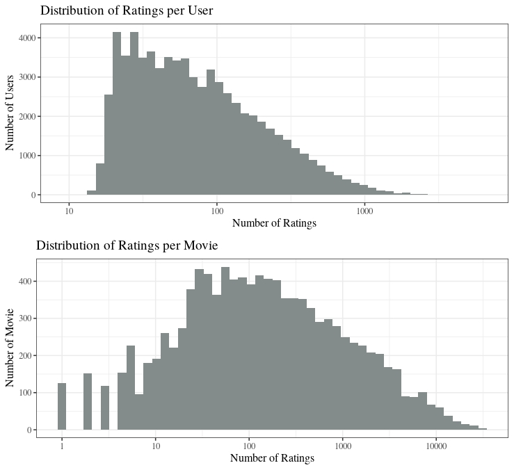

```{r setup, include=FALSE}
knitr::opts_chunk$set(echo = TRUE)
options(tinytex.verbose = TRUE)
```

# **Introduction**
## Project goal:
  The purpose of this project is to create a reliable and light movie recommendation system. Instead of the complete MovieLens dataset, this project will use its 10M version to facilitate the computation. 

## Dataset general information:
  The dataset consists of approximately 10 million ratings of different users to different films (the exact numbers are displayed further in the data exploration section). Also, the dataset provides the films genres and time stamps, in case they are valuable to the analysis.

## Project planning:
  To achieve good performance in the analysis, this project will follow these steps:

  **Methods and Analysis** - Investigate the data set to understand more about it and eventually find a preferred method.  
	**Data preparation** - Clean and prepare the data set for modelling.  
	**Data modelling** - Training and testing the chosen method to prove its effectiveness.  
	**Method validation** - Final testing and results report.  

## Project structure:
  The project separation into three independent scripts has the purpose of only running the necessary and intended code. These divisions are:

  **Data exploration [data_exploration.R]** - This script has the purpose of investigating the data for insights in further analysis.  
  **Experiment [experiment.R]** - This script has the purpose of showing the effectiveness of the LIBMF method.  
   **Final validation [prediction_final.R]** - This script has the intention of displaying the final script.  

# **Methods and Analysis**
## Data Loading
  The next code is supposed to load the required packages for data exploration:
```{r packages, eval=TRUE, message=FALSE}
repo <- "http://cran.us.r-project.org"
if(!require(tidyverse))      install.packages("tidyverse",      repos = repo)
if(!require(caret))          install.packages("caret",          repos = repo)
if(!require(data.table))     install.packages("data.table",     repos = repo)

library(tidyverse)
library(caret)
library(data.table)
```

  The next piece of code will load the train (edx) and validation sets for final testing:
```{r basic sets, eval=TRUE, message=FALSE, warning=FALSE}
if(!exists("edx") & !exists("validation")){
  dl <- tempfile()
  download.file("http://files.grouplens.org/datasets/movielens/ml-10m.zip", dl)
  
  ratings <- fread(text = gsub("::",
                               "\t",
                               readLines(unzip(dl, "ml-10M100K/ratings.dat"))),
                   col.names = c("userId", "movieId", "rating", "timestamp"))
  
  movies <- str_split_fixed(readLines(unzip(dl, "ml-10M100K/movies.dat")),
                            "\\::", 3)
  colnames(movies) <- c("movieId", "title", "genres")
  
  # if using R 4.0 or later:
  movies <- as.data.frame(movies) %>% mutate(movieId = as.numeric(movieId),
                                             title = as.character(title),
                                             genres = as.character(genres))
  
  
  movielens <- left_join(ratings, movies, by = "movieId")
  
  # Validation set will be 10% of MovieLens data
  set.seed(1, sample.kind="Rounding") # if using R 3.5 or earlier, use `set.seed(1)`
  test_index <- createDataPartition(y = movielens$rating, times = 1, p = 0.1,
                                    list = FALSE)
  edx <- movielens[-test_index,]
  temp <- movielens[test_index,]
  
  # Make sure userId and movieId in validation set are also in edx set
  validation <- temp %>% 
    semi_join(edx, by = "movieId") %>%
    semi_join(edx, by = "userId")
  
  # Add rows removed from validation set back into edx set
  removed <- anti_join(temp, validation)
  edx <- rbind(edx, removed)
  
  rm(dl, ratings, movies, test_index, temp, movielens, removed)
}
```

## Data Exploration
  For this project, my research was able to identify some potential algorithms: collaborative filtering, popularity based, random based, and matrix factorization. I understand that there are more modern ways of recommending movies, such as deep learning and neural networks, but I must assume that those are far above my current knowledge, and their study would consume a time that I, unfortunately, don't have. To select one for testing, it is vital to explore our data and understand how it behaves.
  
  Firstly, it is essential to find a favorite algorithm by eliminating others that might be less efficient. Having this in mind, a few interesting data points from our data exploration, such as the distribution of ratings per user, and movie, can provide helpful information. The methods UBCF (User-Based Collaborative Filtering) and IBCF (Item-Based Collaborative Filtering) seem prominent. They are part of a larger group of recommender techniques called *collaborative filtering*, meaning the process of filtering for patterns using the collaboration of other entities (users or items, for example).
  
  To evaluate later data exploration, it is a must to compute the user and movie distributions (most relevant variables):  
```{r distributions, eval=TRUE, message=FALSE}
# Distribution of votes per user:
d_user <- edx %>% group_by(userId) %>%
                  summarize(count = n())

# Distribution of votes per movie:
d_movie <- edx %>% group_by(movieId, title) %>%
                   summarize(count = n())
```
  
  In the book *Introduction to Data Science* by professor Irizarry, the suggested package for PCA and SVD, fantastic methods sadly not examined in this report, is the **recommenderlab**. In the package documentation, UBCF, IBCF, and other valuable techniques are supported. Also, a  version of the 100k MovieLens dataset is present. When analysing other sources of testing materials, it becomes clear the differences between the dataset from the package and the one we are supposed to work with: Ours is a hundred times bigger and possibly not as clean. The functions presented in the recommenderlab package work with a *realRatingMatrix*, but do not mention how it handles its likely enormous final dimensions. Finally, another obstacle related to the size of the matrix is its sparsity, more explicitly seen in the table:

|       | Users                    | Movies                    |
|:------|:-------------------------|:--------------------------|
|Total: |`r n_distinct(edx$userId)`|`r n_distinct(edx$movieId)`|
|Mean:  |`r mean(d_user$count)`    |`r mean(d_movie$count)`    |
|Median:|`r median(d_user$count)`  |`r median(d_movie$count)`  |

  In detail, what can be interpreted from these numbers is that:  
    -Half of the users voted in less than 62 movies, 0.58% of the total number of movies;  
    -The average number of votes per user is $\approx$ 129, which means a share of users voted a lot;  
    -Half of the movies were voted less than 122 times.  
  
  With the next piece of code, we can see graphically the effects of the means and medians:

```{r histograms, eval=FALSE, message=FALSE}
if(!require(grid))      install.packages("grid",      repos = repo)
if(!require(gridExtra)) install.packages("gridExtra", repos = repo)

library(grid)
library(gridExtra)

# Users
h_user <- d_user %>% ggplot(aes(count)) +
          scale_x_log10() +
          geom_histogram(bins = 50, fill = "azure4") +
          ggtitle("Distribution of Ratings per User") +
          ylab("Number of Users") +
          xlab("Number of Ratings") +
          theme_bw(base_size = 12, base_family = "times")

# Movies
h_movie <- d_movie %>% ggplot(aes(count)) +
           scale_x_log10() +
           geom_histogram(bins = 50, fill = "azure4") +
           ggtitle("Distribution of Ratings per Movie") +
           ylab("Number of Movie") +
           xlab("Number of Ratings") +
           theme_bw(base_size = 12, base_family = "times")

# Grid
grid.arrange(h_user,h_movie, nrow = 2)
```
{width=100% height=100%}

## Solution
  Having all of this in mind, it becomes troublesome to work with the recommenderlab package. In detail, the future matrix will be composed of almost nothing, consuming the memory considerably. The solution to this problem is to select less data, but how much data could be sacrificed without compromising accuracy? Beyond this problem, in supplementary studies, the reported loss functions of the package's Movie Lens data set is not satisfactory. Therefore, recommenderlab is not an option.

When researching recommender systems for sparse matrices, a method becomes applicable: **LIBMF**. This Matrix Factorization library is a *tool for approximating an incomplete matrix using the product of two matrices in a latent space*. With a variety of package options, a more user-friendly one can help substantially the predictions: the *recosystem* package.

# **Data Preparation**
## Data Loading
  The next code is supposed to load the last required package:
```{r packages_dp, eval=TRUE, message=FALSE}
repo <- "http://cran.us.r-project.org"

if(!require(recosystem))     install.packages("recosystem",     repos = repo)
library(recosystem)
```

## Data Arrangement
  First, it is necessary to create the train and test sets based on the edx data set:
```{r d_arr, eval=TRUE, message=FALSE, warning=FALSE}
set.seed(2021, sample.kind = "Rounding")

# Data sets
test_index <- createDataPartition(edx$rating, times = 1,
                                  p = 0.2, list = FALSE)
train_set <- edx[-test_index]
test_set  <- edx[test_index]

# Making sure all movies and users appear in both data sets
test_set <- test_set %>%
  semi_join(train_set, by = "movieId") %>%
  semi_join(train_set, by = "userId")

```
  Then, it is necessary to "translate" the data table to something recosystem functions can interpret:
```{r d_arr2, eval=TRUE, message=FALSE, warning=FALSE}
set.seed(2021, sample.kind = "Rounding")

# Translating the train and test sets to a recosystem set
train_data <-  with(train_set, data_memory(user_index = userId, 
                                           item_index = movieId, 
                                           rating     = rating))

test_data  <-  with(test_set,  data_memory(user_index = userId, 
                                           item_index = movieId, 
                                           rating     = rating))
```
  Also, before going to modelling, a loss function (RMSE) must be created:
```{r rmse, eval=TRUE, message=FALSE}
# RMSE function
rmse <- function(true, predicted){sqrt(mean((true - predicted)^2))}
```
  The *Root Mean Square Error* is the standard deviation of the prediction errors, i.e. it is the distance between observed and predicted values.

# **Data Modelling**
  After data preparation, a recommender model is created. Even if not required, it is advantageous to tune parameters and select the finest. 
```{r d_model1, eval=TRUE, message=FALSE}
# Creating a recommender model:
r <- Reco()

# Tuning parameters:
# This process can take a while =(
tune <- r$tune(train_data, opts = list(dim      = c(10, 20, 30),
                                       lrate    = c(0.1, 0.2),
                                       costp_l2 = c(0.01, 0.1), 
                                       costq_l2 = c(0.01, 0.1),
                                       nthread  = 4, 
                                       niter    = 10))
```
  The tune parameters used in later training can be found running the code:
```{r d_model2, eval=TRUE, message=TRUE}
tune$min
```
  After done tuning, we are prepared for training and predicting:
```{r d_model3, eval=TRUE, message=FALSE}
# Training model:
r_train <- r$train(train_data, opts = c(tune$min, nthread = 1, niter = 30))

# Prediction model:
r_predict <- r$predict(test_data, out_memory())
```
  With all set, we calculate the RMSE and find out that the LIBMF method is really efficient:
```{r d_result, eval=TRUE, message=TRUE}
# RMSE results:
result <- rmse(test_set$rating, r_predict)
result
```

# **Method Validation**
  Given that the method worked really well on the partitioned data set, it should work on the validation set. Therefore, the steps will be repeated but with different training and testing sets:
```{r d_v, eval=TRUE, message=FALSE}
set.seed(2021, sample.kind = "Rounding")

# Translating the train and test sets to a recosystem set
edx_data <- with(edx, data_memory(user_index = userId, 
                                  item_index = movieId, 
                                  rating     = rating))

validation_data <- with(validation,  data_memory(user_index = userId, 
                                                 item_index = movieId, 
                                                 rating     = rating))

# Creating a recommender model:
r_v <- Reco()

# Tuning parameters:
# This process can take a while =(
tune_v <- r$tune(edx_data, opts = list(dim      = c(10, 20, 30),
                                     lrate    = c(0.1, 0.2),
                                     costp_l2 = c(0.01, 0.1), 
                                     costq_l2 = c(0.01, 0.1),
                                     nthread  = 4, 
                                     niter    = 10))
```

  Again, the tune parameters to be used are:
```{r tunee, eval=TRUE, message=TRUE}
tune_v$min
```
  Training and predicting:  

```{r ddd, eval=TRUE, message=FALSE, warning=FALSE}
# Training model:
r_train_v <- r$train(edx_data, opts = c(tune$min, nthread = 1, niter = 30))

# Prediction model:
r_predict_v <- r$predict(validation_data, out_memory())
```
  After that, we calculate the final RMSE: 

```{r res_v, message=TRUE, warning=FALSE}
# RMSE results:
result_v <- rmse(validation$rating, r_predict_v)
result_v
```
  The results shown in the final validation are excellent! With that, we complete the final tests.

# **Conclusion**
## Results
  The report's goal was to analyze, test, and evaluate preferred methods in the quest for light and reliable recommender systems. The chosen data set to work with was the 10M Movie Lens, and the best algorithm was the LIBMF. The expected (training and testing on partitioned edx data set) and observed(training on edx data and tested on validation set) final RMSEs were:

|          | RMSE:      |
|:---------|:-----------|
|Expected: |`r result`  |
|Observed: |`r result_v`|

## Limitations and Future work
  Machine learning algorithms demand a lot of processing velocity, time, and memory use, requiring plenty of study and investigation prior to code formulation. Nevertheless, this is a price to pay for good results.
	There are other algorithms not tested in this report that might work well in sparse matrices, for example, NOMAD, and GraphChi. Also, further studies in the applicability of neural networks and deep learning on recommender systems are necessary since they might produce more solid results.

# **References**

  Hahsler, Michael. “Recommenderlab - Lab for Developing and Testing Recommender Algorithms - R Package.” RDocumentation, Rcran, 26 Feb. 2021, www.rdocumentation.org/packages/recommenderlab/versions/0.2-7. 
  
  Hahsler, Michael. “Recommenderlab: A Framework for Developing AndTesting Recommendation Algorithms.” RDocumentation, 2016, cran.r-project.org/web/packages/recommenderlab/vignettes/recommenderlab.pdf. 

  Irizarry, Rafael  A. Introduction to Data Science. Leanpub, 2021. 

  Luo, Shuyu. “Intro to Recommender System: Collaborative Filtering.” Medium, Towards Data Science, 6 Feb. 2019, towardsdatascience.com/intro-to-recommender-system-collaborative-filtering-64a238194a26. 
  
Qiu, Yixuan. “Recosystem Package.” RDocumentation, May 2021, www.rdocumentation.org/packages/recosystem/versions/0.4.5. 
  